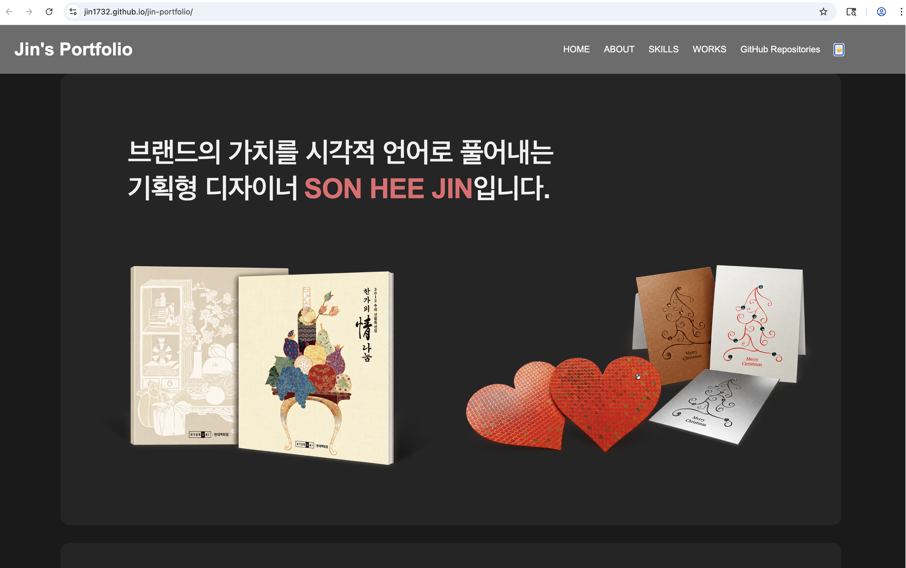
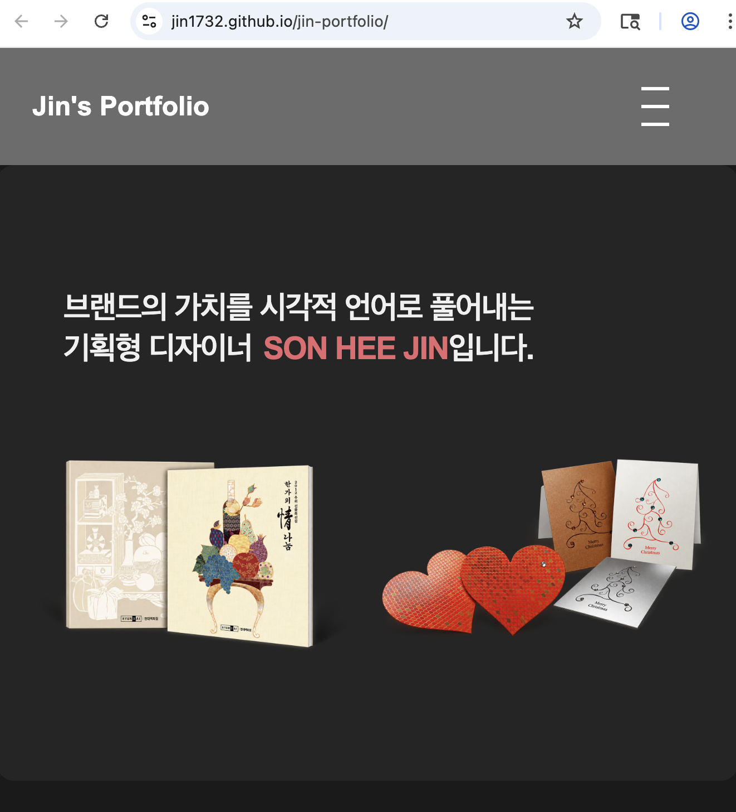

# 디자이너 포트폴리오 웹사이트
### 이 프로젝트는 저의 디자인 작업물과 기술 스택을 소개하기 위한 개인 포트폴리오 웹사이트입니다. HTML5를 사용하여 웹 표준에 맞는 시맨틱한 구조로 제작되었습니다.

---

>## 1. 실행 환경
- OS: macOS Sequoia 15.7.4
- Editor: VS Code(Live Server 확장 프로그램 사용)
- Browser: Chrome 

>## 2. 설계 및 뼈대 잡기 (HTML)
- **시맨틱 마크업(Semantic Markup) 이해 및 적용**
- **HTML5**: 웹사이트의 뼈대 구성
- header, nav : 상단 메뉴 및 네비게이션
- main, section : 주요 콘텐츠 영역 구분
- footer : 저작권 및 연락처 정보
- h1~h6 : 제목 계층 구조
- p : 본문 문단 작성

```html
<!DOCTYPE html>
<html lang="ko">
<head>
    <meta charset="UTF-8">
    <title>jin portfolio</title>
</head>
<body>
     <!-- 로고와 메뉴가 들어갈 곳 -->
    <header>
        <h1>Jin's Portfolio</h1> <!-- 로고 대신 이름을 넣었어요 -->
        <nav>
            <ul>
                <li><a href="#hero">HOME</a></li>
                <li><a href="#about">ABOUT</a></li>
                <li><a href="#skills">SKILLS</a></li>
                <li><a href="#design-works">WORKS</a></li>
            </ul>
        </nav>
    </header>
    <main>
        <section id="hero"> <!-- 나를 소개하는 첫 화면 -->
            <h2>안녕하세요, 디자이너 Jin입니다.</h2>
            <p>사용자의 경험을 디자인하는 UI/UX 디자이너입니다.</p>
        </section>
        <section id="about"> <!-- 상세 소개 -->
            <h2>ABOUT</h2>
            
            <p>
                안녕하세요! 저는 사용자 중심의 인터페이스를 고민하는 디자이너 Jin입니다.<br>
                복잡한 문제를 단순하고 아름답게 해결하는 것을 좋아합니다.
            </p>
        </section>
        <section id="skills"> <!-- 기술 스택 -->
            <h2>SKILLS</h2>
            <ul>
                <li><strong>Design:</strong>Adobe Photoshop, Illustrator</li>
                <li><strong>Web design:</strong> HTML, CSS, JavaScript</li>
                <li><strong>Tools:</strong> Notion, Git</li>
            </ul>
        </section>
        <section id="design-works"> <!-- 프로젝트 모음 -->
            <h2>WORKS</h2>
            <div class="works-item">
                
                <h3>프로젝트 제목 1</h3>
                <p>프로젝트에 대한 짧은 설명입니다. 어떤 문제를 해결했는지 적어보세요.</p>
            </div>

            <div class="works-item">
                
                <h3>프로젝트 제목 1</h3>
                <p>프로젝트에 대한 짧은 설명입니다. 어떤 문제를 해결했는지 적어보세요.</p>
            </div>
        </section>
    </main>
    <footer> <!-- 연락처 및 저작권 정보 -->
        <p>&copy; 2024. [손희진]. All rights reserved.</p>
        <p>Email: your-email@example.com</p>
    </footer>
</body>
</html>
```
### 학습한 주요 용어
- **시맨틱 마크업 (Semantic Markup)**: 태그의 의미를 명확히 하여 구조를 설계함 (header, main, footer 등).
- **태그 쌍 (Tag Pair)**: 열기 태그와 닫기 태그를 통해 콘텐츠의 범위를 지정함.
- **주석 (Comment)**: <!-- -->를 활용해 코드의 가독성을 높이고 설명을 기록함.

>## 3. 스타일링 및 레이아웃 (CSS)

### ①CSS(Cascading Style Sheets) 기초 
- HTML 문서에 style.css 파일 연결 (<link> 태그 사용)
- 선택자(Selector), 속성(Property), 값(Value)의 기본 문법 이해
- 색상 코드(Hex)와 크기 단위(px, rem) 적용

```css
* {
    margin: 0;
    padding: 0;
    box-sizing: border-box;
}

body {
    font-family: Arial, Helvetica, sans-serif;
    line-height: 1.6;
    margin: 0;
    padding: 0;
    background-color: #f4f4f4;
}

/* 헤더 스타일 */
header {
    background: #333;
    color: #fff;
    padding: 1rem;
    text-align: center;
}

/* 내비게이션 바 스타일 */
nav {
    background-color: #333;
    padding: 1rem;
    text-align: center;
}

nav a {
    color: white;
    text-decoration: none; /* 밑줄 제거 */
    margin: 0 15px;        /* 메뉴 간격 */
    font-weight: bold;
}

/* 마우스를 올렸을 때 효과 */
nav a:hover {
    color: #ffcc00;      /* 색상 변경 */
    text-decoration: underline;
}

/* 섹션 스타일 */
section {
    padding: 20px;
    margin: 10px;
    background: #fff;
}
```

### 학습한 주요 용어
- **CSS 초기화 (Reset CSS)**: 브라우저마다 기본적으로 가지고 있는 여백(margin, padding)을 제거하여 모든 브라우저에서 동일한 디자인이 보이도록 설정하는 것 (예: * { margin: 0; ... }).
- **박스 모델 (Box Model)**: 모든 HTML 요소를 사각형 박스로 간주하고, margin(바깥 여백), padding(안쪽 여백), border(테두리)로 구성하는 개념.
- **box-sizing: border-box**: 박스의 크기를 계산할 때 padding과 border를 포함하여, 설정한 너비(width)가 변하지 않게 고정해 주는 속성.
- **선택자 (Selector)**: 스타일을 적용할 HTML 요소를 선택하는 방법 (예: 태그 선택자 header, 전체 선택자 *).
- **가상 클래스 (Pseudo-class)**: 요소의 특정 상태에 스타일을 적용할 때 사용 (예: :hover는 마우스를 올렸을 때의 상태).
- **단위 (Units)**: px: 고정된 픽셀 단위. rem: 루트(최상위) 요소의 글자 크기를 기준으로 하는 상대적 단위 (반응형 디자인에 유리).


### ② Flexbox를 활용한 레이아웃 설계 
- Flexbox 활용: display: flex를 사용하여 요소들을 가로/세로로 자유롭게 배치.
- 2x2 카드 배열: flex-wrap: wrap과 calc() 함수를 사용하여 화면 크기에 맞는 반응형 2열 구조 생성.
- 정밀한 크기 계산: width: calc(50% - 16px)를 사용하여 카드 사이의 간격을 유지하며 정확히 2등분함.
- 정렬과 간격: justify-content와 gap 속성을 사용하여 카드 사이의 일정한 여백 구현.

```html
                <div class="projects-card">
                    <div class="card-top">
                        <a href="#" class="repo-name">my-docker2</a>
                        <span class="badge">Public</span>
                    </div>
                    <div class="card-bottom">
                        <span class="lang-dot html"></span>
                        <span class="lang-text">HTML</span>
                    </div>
                </div>
```
```css
/* 헤더 부분 (글자와 링크 양옆 배치) */
.projects-header{
    display: flex;
    justify-content: space-between;
    align-items: center;
    margin-bottom: 16px;
}

/* 카드 컨테이너 (2개씩 배치하는 핵심!) */
.projects-container {
    display: flex;
    flex-wrap: wrap;
    gap: 16px;
}

/* 개별 카드 스타일 */
.projects-card{
    flex: 1 1 calc(50% - 8px);   /* 한 줄에 2개씩 */
    border: 1px solid #d0d7de; /* 테두리 */
    border-radius: 6px;          /* 모서리 둥글게 */
    padding: 16px;
    display: flex;
    flex-direction: column;      /* 위아래로 배치(열) */
    justify-content: space-between;
    min-height: 100px;
}

/* 카드 내부 상세 스타일 */
.repo-name {
    color: #0969da;
    text-decoration: none;
    font-weight: bold;
}

.badg {
    font-size: 12px;
    border: 1px solid #d0d7de;
    border-radius: 10px;
    padding: 2px 8px;
    color: #57606a;
}
```

### 학습한 주요 용어
- **Flexbox (플렉스박스)**: 복잡한 레이아웃을 쉽고 유연하게 배치할 수 있도록 돕는 CSS의 1차원 레이아웃 모델.
- **flex-wrap**: 컨테이너 안의 요소들이 화면을 넘어갈 때, 다음 줄로 자연스럽게 줄바꿈을 할지 결정하는 속성 (wrap 적용 시 줄바꿈됨).
- **justify-content**: 메인 축(주로 가로 방향)을 기준으로 요소들을 어떻게 정렬할지 결정하는 속성 (예: space-between, center 등).
- **gap**: Flex 요소들 사이의 여백(간격)을 일정하게 설정해 주는 속성으로, 복잡한 margin 계산을 대체할 수 있어 매우 유용함.
- **calc() 함수**: CSS 내부에서 사칙연산(+, -, *, /)을 수행하여 너비나 높이 등의 값을 동적으로 계산하는 함수 (예: calc(50% - 16px)).


### ③ 반응형 웹 디자인 (Responsive Web Design) 및 미디어 쿼리
- Media Query 적용: @media (max-width: 480px)를 사용하여 모바일 화면(480px 이하)에 맞는 레이아웃으로 변경했습니다.
- 모바일 최적화: 모바일 환경에서 글자 크기(font-size)와 여백(padding)을 줄이고, 내비게이션 메뉴를 세로(column)로 배치하여 가독성을 높였습니다.
- 반응형 테스트: Chrome 개발자 도구(DevTools)의 Device Mode를 활용하여 400px 등 다양한 모바일 기기 해상도에서 레이아웃이 깨지지 않는지 확인 및 디버깅을 진행했습니다.

```css
@media (max-width: 768px) {
    .projects-container {
        flex-direction: column;
    }
    .projects-card {
        flex: 1 1 100%;
    }
    .projects-header {
        flex-direction: column;
        align-items: flex-start;
        gap: 8px
    }
    nav ul {
        flex-wrap: wrap;
        justify-content: center;
    }
}

@media (max-width: 480px) {
    header {
        padding: 16px;
    }
    nav ul {
        flex-direction: column;
        gap: 8px;
    }
    .projects-card {
        padding: 16px;
    }
    .projects-header h2 {
        font-size: 20px;
    }
    .projects-header a {
        font-size: 14px;
    }
}
```
### 학습한 주요 용어
- **반응형 웹 (Responsive Web)**: PC, 태블릿, 스마트폰 등 접속하는 기기의 화면 크기에 맞춰 레이아웃이 자동으로 변하는 웹사이트 디자인 기법.
- **미디어 쿼리 (Media Query)**: 화면의 너비(width)나 해상도에 따라 다른 CSS 스타일을 적용할 수 있게 해주는 CSS 문법 (예: `@media (max-width: 480px)`).
- **중단점 (Breakpoint)**: 미디어 쿼리에서 레이아웃이나 스타일이 바뀌는 기준이 되는 화면의 픽셀 값 (예: 480px, 768px 등).
- **뷰포트 (Viewport)**: 사용자의 기기 화면에서 실제 웹페이지가 표시되는 영역. (HTML <head> 태그 안에 <meta name="viewport">를 설정해야 모바일에서 정상적으로 반응형이 작동함).
- **개발자 도구 (DevTools)**: 브라우저(Chrome 등)에서 제공하는 도구로, 'Device Mode'를 통해 다양한 모바일 기기의 화면 크기(예: 400px)를 시뮬레이션하고 실시간으로 CSS를 테스트할 수 있음.


>## 4. 동적 기능 구현 (JavaScript)

### DOM 조작 및 이벤트 바인딩
- DOM 제어: document.querySelector를 사용하여 HTML 요소를 선택하고, 클릭이나 스크롤 이벤트에 따라 화면을 동적으로 변화시켰습니다.
- 이벤트 리스너: addEventListener를 활용하여 햄버거 메뉴 클릭, 스크롤 시 네비게이션 바 스타일 변경, '맨 위로 가기' 버튼 표시 등을 구현했습니다.
- 스크롤 애니메이션: Intersection Observer API 또는 스크롤 이벤트를 활용하여 화면에 요소가 나타날 때 서서히 등장하는 효과를 적용했습니다.

```javascript
// 1. 햄버거 메뉴 토글 (모바일 네비게이션)
const menuToggle = document.querySelector('.menu-toggle');
const navLinks = document.querySelector('.nav-links');

menuToggle.addEventListener('click', () => {
    navLinks.classList.toggle('active'); // 클릭 시 메뉴 표시/숨김
});

// 2. 맨 위로 가기 버튼 (스크롤 이벤트)
const scrollTopBtn = document.getElementById("scroll-top");

window.addEventListener('scroll', () => {
    // 300px 이상 스크롤 시 버튼 표시
    if (window.scrollY > 300) {
        scrollTopBtn.style.display = "block";
    } else {
        scrollTopBtn.style.display = "none";
    }
});

const observer = new IntersectionObserver((entries) => {
    entries.forEach((entry) => {
        // 요소가 화면에 50% 이상 보일 때 'show' 클래스 추가
        if (entry.isIntersecting) {
            entry.target.classList.add('show');
        }
    });
});

// 모든 section 태그를 관찰 대상으로 등록
const sections = document.querySelectorAll('section');
sections.forEach((el) => observer.observe(el));
```
### 학습한 주요 용어
- **DOM (Document Object Model)**: HTML 문서의 구조를 나무(Tree) 형태로 표현하여 자바스크립트가 제어할 수 있게 만든 모델.
- **이벤트 리스너 (Event Listener)**: 클릭, 스크롤, 입력 등 사용자의 동작을 감지하여 특정 함수를 실행시키는 장치.
- **화살표 함수 (Arrow Function)**: () => {} 형태로 함수를 간결하게 표현하는 최신 자바스크립트 문법.

>## 5. 데이터 연동 및 비동기 처리 (API)

### GitHub API 연동
- 비동기 통신: fetch API를 사용하여 GitHub 저장소 데이터를 실시간으로 불러왔습니다.
- 데이터 가공: 불러온 JSON 데이터를 forEach() 메서드를 사용하여 카드 형태의 HTML 구조로 변환하고 화면에 렌더링했습니다.
- 예외 처리: try...catch 문을 사용하여 데이터를 불러오는 중 발생할 수 있는 에러(네트워크 오류 등)를 처리하고, 로딩 중 상태를 화면에 표시했습니다.

```javascript
// 비동기 통신 (fetch API)
async function getRepos() {
    // fetch API를 이용해 GitHub 서버에 데이터를 요청함
    const response = await fetch(apiUrl);
    const repos = await response.json(); // 응답 데이터를 JSON 형식으로 변환
    
    displayRepos(repos); // 가져온 데이터를 화면 그리기 함수로 전달
}

// 데이터 가공 및 렌더링 (forEach/map)
function displayRepos(repos) {
    const projectGrid = document.getElementById('project-grid');
    projectGrid.innerHTML = ''; // 기존 내용을 비움

    // 데이터 배열을 순회하며(forEach) 각 프로젝트당 하나의 카드를 생성
    repos.forEach(repo => {
        const card = document.createElement('div');
        card.className = 'project-card'; // CSS 스타일 적용을 위한 클래스 부여

        // 데이터를 HTML 구조에 바인딩
        card.innerHTML = `
            <h3>${repo.name}</h3>
            <p>${repo.description || '설명이 없습니다.'}</p>
            <a href="${repo.html_url}" target="_blank">자세히 보기</a>
        `;
        projectGrid.appendChild(card); // 완성된 카드를 화면(Grid)에 추가
    });
}

// 예외 처리 및 로딩 상태 관리 (try...catch)
async function getRepos() {
    try {
        // 성공 시 실행되는 구역
        const response = await fetch(apiUrl);
        const repos = await response.json();

        // 로딩 메시지 제거
        const loadingElement = document.getElementById('loading');
        if (loadingElement) loadingElement.remove();

        displayRepos(repos);
    } catch (error) {
        // 에러 발생 시(네트워크 오류 등) 실행되는 구역
        console.error("에러 발생:", error);
        const loadingElement = document.getElementById('loading');
        if (loadingElement) {
            loadingElement.innerText = "데이터를 불러오지 못했습니다.";
        }
    }
}
```
### 학습한 주요 용어
- **API (Application Programming Interface)**: 서로 다른 프로그램이 데이터를 주고받기 위한 약속이나 통로.
- **비동기 처리 (Asynchronous)**: 특정 작업이 끝날 때까지 기다리지 않고 다음 코드를 실행하여 웹사이트의 멈춤 현상을 방지하는 방식.
- **async/await**: 비동기 코드를 마치 동기 코드처럼 읽기 쉽게 작성할 수 있게 해주는 문법.
- **JSON (JavaScript Object Notation)**: 데이터를 주고받을 때 사용하는 가벼운 텍스트 형식.


>## 6. 고급 기능 및 상태 관리

### ① 다크 모드 및 상태 유지
- CSS 변수 활용: :root에 정의된 색상 변수를 자바스크립트로 조작하여 다크/라이트 테마를 전환했습니다.
- LocalStorage: 사용자가 설정한 테마 모드를 브라우저에 저장하여, 페이지를 새로고침하거나 다시 방문해도 설정이 유지되도록 구현했습니다.

### ② 폼 유효성 검사 (Form Validation)
- 정규표현식 (RegExp): 이메일 입력란에 올바른 형식(@, . 포함)이 입력되었는지 실시간으로 검사하는 로직을 구현했습니다.
- 사용자 피드백: 필수 항목이 누락되었을 때 경고 메시지를 띄워 데이터 전송 전 오류를 방지했습니다.

```css
:root {
    --bg-color: #f9f9f9;
    --section-bg: #ffffff;
    --text-color: #414141;
    --card-bg: #ffffff;
    --section-tit: #65748e;
}

/* 다크 테마 */
body.dark-mode {
    --bg-color: #1a1a1a;
    --section-bg: #252525;
    --text-color: #f0f0f0;
    --card-bg: #333333;
    --section-tit: #9779c1;
}
```
```javascript
// 페이지 로드 시 상태 적용
if (isDarkMode) {
    body.classList.add('dark-mode');
    if (toggleBtn) toggleBtn.textContent = '☀️'; // 다크모드면 해 아이콘
} else {
    if (toggleBtn) toggleBtn.textContent = '🌙'; // 라이트모드면 달 아이콘
}

//폼 유효성 검사 (Form Validation) 및 사용자 피드백
const contactForm = document.getElementById('contact-form');

// 폼이 존재할 때만 실행하도록 감싸줍니다.
if(contactForm) {
    contactForm.addEventListener('submit', function(e) {
        e.preventDefault();
        const name = document.getElementById('name').value;
        const email = document.getElementById('email').value;
        
        // 1. 이메일 형식을 검사하는 정규식
        const emailPattern = /^[^\s@]+@[^\s@]+\.[^\s@]+$/;

        if(name === "" || email === "") {
            // 이름이나 이메일이 비어있을 때
            alert("이름과 이메일을 모두 입력해주세요!");
        } else if (!emailPattern.test(email)) {
            // 이메일 형식이 올바르지 않을 때
            alert("올바른 이메일 형식을 입력해주세요! (예: user@mail.com)");
        } else {
            // 모든 조건이 통과되었을 때
            alert("메시지가 성공적으로 전송되었습니다!");
            contactForm.reset();
        }
    });
}
```
### 학습한 주요 용어
- **LocalStorage**: 브라우저에 데이터를 반영구적으로 저장하는 저장소 (쿠키보다 용량이 크고 관리가 쉬움).
- **상태 관리 (State Management)**: 현재 다크모드인지, 데이터가 로딩 중인지 등 앱의 현재 상황(상태)을 객체로 관리하는 개념.


>## 7. 배포 (Deployment)

### GitHub Pages를 통한 웹 게시
- 버전 관리: Git을 사용하여 코드의 변경 이력을 기록하고 GitHub 원격 저장소에 푸시했습니다.
- 정적 호스팅: GitHub Pages 기능을 활용하여 작성한 코드를 실제 웹사이트 주소로 배포 완료했습니다.


